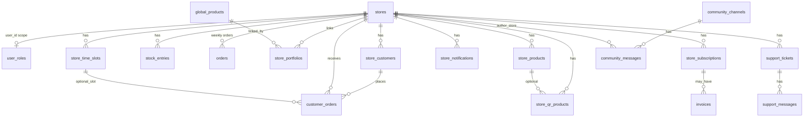

# Database structure and API surface (NestJS migration reference)

This document summarizes **`public` schema** entities and the **HTTP/RPC surface** implied by the current Supabase-backed app. Source of truth for column types: [`src/integrations/supabase/types.ts`](../src/integrations/supabase/types.ts). SQL definitions: [`supabase/migrations/`](../supabase/migrations/).

**Not in `public`:** Supabase **`auth.users`** (and MFA factors) — you will replace with your own user/session model in Nest while keeping compatible **`user_id`** / **`stores.user_id`** references if UUIDs are preserved.

---

## 1. Conceptual domains

| Domain | Purpose |
|--------|---------|
| **Identity & roles** | `user_roles` (`app_role`: `admin` \| `store_owner`); links to Supabase Auth user UUID today. |
| **Stores** | Core tenant: profile, QR slug, plans, community flags, webhooks. |
| **Catalog (B2B / internal)** | `global_products`, `store_products`, `store_portfolios`, `stock_entries`, weekly **`orders`** (legacy JSON product lines). |
| **QR / customer ordering** | `store_customers`, `store_time_slots`, `customer_orders`, `store_notifications`, `store_qr_products`. |
| **Support & community** | `support_tickets`, `support_messages`, `community_channels`, `community_messages`. |
| **Billing** | `store_subscriptions`, `invoices`, `coupons`, `coupon_redemptions`, `webhook_logs`. |
| **Email infra** | `email_send_log`, `email_send_state`, `email_unsubscribe_tokens`, `suppressed_emails`, PGMQ-style RPCs (`enqueue_email`, …). |
| **Security / audit** | `audit_logs`, `login_attempts`, `customer_otp_codes`. |
| **Feedback** | `feedback`. |

**Important:** **`orders`** (weekly stock/order PDF flow) and **`customer_orders`** (public QR order pipeline) are **different** tables.

---

## 2. Entity relationship (high level)

---

## 3. Tables (`public`)

### 3.1 Core & access

| Table | Primary key | Key columns / notes |
|-------|-------------|---------------------|
| **stores** | `id` (text) | `user_id` → auth user; `qr_slug` (public URL segment); `plan_type`, trials, QR/community flags; `profile_picture_url`; `unit_suggestion_rules` (json); address fields; `webhook_url`. |
| **user_roles** | `id` | `user_id`, `role` (`app_role`). |

### 3.2 Catalog & internal operations

| Table | FK / notes |
|-------|------------|
| **global_products** | Master catalog: `brand_name`, `unit_name`, barcodes, `manufacturer_name`. |
| **store_products** | Per-store catalog line; `store_id` → stores. |
| **store_portfolios** | Many-to-many: `store_id` + `global_product_id`. |
| **stock_entries** | `store_id`, `week_date`, stock metrics; optional `product_id` → `store_products`. |
| **orders** | Legacy **weekly** orders: `week_date`, `products` (json), `total_items`, `store_id`. |

### 3.3 QR / customer-facing orders

| Table | FK / notes |
|-------|------------|
| **store_customers** | `store_id`; `name`, `email`, `contact_no`, `referral_code`, `address`. |
| **store_time_slots** | `store_id`; `slot_label`, `slot_type`, `day_type`, `is_active`. |
| **customer_orders** | `store_id`, `customer_id` → `store_customers`; `order_details`, `status`, `collection_number`, `time_slot_id`, `preferred_time`, `order_type`, `delivery_address`, `admin_notes`. |
| **store_notifications** | `store_id`; `related_order_id` → `customer_orders`; `title`, `message`, `type`, `is_read`. |
| **store_qr_products** | Menu for QR flow: `store_id`, optional `store_product_id`, `display_name`, `display_order`, `is_active`. |

### 3.4 Support & community

| Table | Notes |
|-------|--------|
| **support_tickets** | `store_id`, `subject`, `status`, `store_email`, `store_name`. |
| **support_messages** | `ticket_id`; `sender_type`, `message`. |
| **community_channels** | `name`, `description`. |
| **community_messages** | `channel_id`, `store_id`, `message`. |

### 3.5 Billing & coupons

| Table | Notes |
|-------|--------|
| **store_subscriptions** | PayPal ids, `plan_type`, `status`, `amount`, `billing_cycle`, pause/grace fields, `store_id`. |
| **invoices** | `store_id`, `subscription_id`, `invoice_number`, amounts, `plan_type`, `status`. |
| **coupons** | `code`, discounts, validity, `used_count`, `applicable_plans`. |
| **coupon_redemptions** | `coupon_id`, `store_id`, `subscription_id`, `discount_applied`. |
| **webhook_logs** | PayPal/external: `event_type`, `payload` (json), `store_id`, `subscription_id`, `status`. |

### 3.6 Email & compliance

| Table | Notes |
|-------|--------|
| **email_send_log** | `recipient_email`, `template_name`, `status`, `metadata` (json). |
| **email_send_state** | Singleton-style tuning: batch sizes, TTLs, delays. |
| **email_unsubscribe_tokens** | `email`, `token`, `used_at`. |
| **suppressed_emails** | `email`, `reason`, `metadata`. |

### 3.7 OTP, audit, feedback

| Table | Notes |
|-------|--------|
| **customer_otp_codes** | `store_id`, `phone_number`, `code`, `expires_at`, `verified`. |
| **audit_logs** | `admin_user_id`, `action`, `target_type`, `target_id`, `details` (json), `ip_address`. |
| **login_attempts** | `email`, `success`, `ip_address`, `attempted_at`. |
| **feedback** | Public feedback: `name`, `email`, `message`. |

---

## 4. PostgreSQL enums

| Enum | Values |
|------|--------|
| **app_role** | `admin`, `store_owner` |

---

## 5. PostgreSQL functions (RPC) — map to Nest services

| Function | Args (summary) | Returns / behavior | Typical API replacement |
|----------|----------------|--------------------|-------------------------|
| **has_role** | `_user_id`, `_role` | `boolean` | `GET /api/v1/auth/me` claims or `GET /api/v1/admin/authorize` — server checks `user_roles`. |
| **generate_store_id** | — | `string` | `POST /api/v1/internal/stores/next-id` or generated inside `POST /api/v1/stores`. |
| **check_store_duplicate** | `_email`, `_contact_no` | rows `{ email_taken, contact_taken }` | `POST /api/v1/registration/check-duplicate`. |
| **get_public_store_by_slug** | `_slug` | store public fields | `GET /api/v1/public/stores/by-slug/:slug`. |
| **get_active_time_slots_for_store** | `_store_id` | slot rows | `GET /api/v1/public/stores/:storeId/time-slots` (or by slug). |
| **get_qr_products_for_store** | `_store_id` | display rows | `GET /api/v1/public/stores/:storeId/qr-products`. |
| **validate_store_customer** | `_store_id`, `_name`, `_contact_no` | customer row or empty | `POST /api/v1/public/orders/validate-customer`. |
| **get_order_status_by_id** | `_order_id` | `status`, `collection_number` | `GET /api/v1/public/orders/:orderId/status`. |
| **get_order_by_collection_number** | `_store_id`, `_collection_number` | `customer_orders` row | `GET /api/v1/employee/...` or public lookup as designed. |
| **verify_customer_otp** | `_email`, `_code`, `_store_id` | `boolean` | Prefer Edge parity: `POST /api/v1/.../otp/verify` (also DB-backed). |
| **is_active_store** | `_store_id` | `boolean` | Internal helper in service layer. |
| **generate_invoice_number** | — | `string` | Inside billing service when creating invoices. |
| **enqueue_email**, **read_email_batch**, **delete_email**, **move_to_dlq** | queue PGMQ API | — | Replace with **BullMQ / SQS / pg-boss** or keep PGMQ via `$queryRaw` in Prisma. |

DB triggers **`notify_store_new_customer`**, **`notify_store_new_order`** (in migrations) may fire side effects — reimplement as explicit Nest calls after writes.

---

## 6. Edge Functions (Supabase) — map to Nest controllers

| Edge function | Role | Nest direction |
|---------------|------|----------------|
| **auth-email-hook** | Auth emails via Supabase | Nest auth email sender + templates. |
| **send-transactional-email** | Template mail | `POST /api/v1/email/send` (internal) + queue worker. |
| **process-email-queue** | Drains queue | Nest **cron** or worker process. |
| **preview-transactional-email** | Preview HTML | `POST /api/v1/admin/email/preview` (admin-guarded). |
| **send-customer-otp** / **verify-customer-otp** | Customer OTP (may overlap SQL **verify_customer_otp**) | `POST .../otp/send`, `POST .../otp/verify`. |
| **send-registration-otp** | Registration OTP | `POST /api/v1/auth/registration/otp`. |
| **notify-store-order** | Notify store on new order | Called after `customer_orders` insert; internal service. |
| **send-order-sms** | SMS | `POST /api/v1/integrations/sms/order-status` (internal). |
| **paypal-checkout** | PayPal subscription / billing | `POST /api/v1/billing/paypal/*` + **webhook** `POST /api/v1/webhooks/paypal`. |
| **check-subscriptions** | Scheduled billing checks | Nest `@Cron` or external scheduler. |
| **handle-email-unsubscribe** | GET token unsubscribe | `GET /api/v1/email/unsubscribe?token=` |
| **handle-email-suppression** | Suppression list API | `POST /api/v1/internal/email/suppression` (secured). |

---

## 7. Storage (Supabase)

- **Bucket:** `store-profiles` — profile images; paths referenced in **`stores.profile_picture_url`**.
- **Nest:** S3-compatible upload + public URL; migrate objects per migration plan.

---

## 8. Realtime (today: Supabase channels)

Subscribe/notify patterns in UI for **orders**, **notifications**, **support**, **community** → replace with **Nest WebSocket gateway** or polling; events should align with `customer_orders`, `store_notifications`, `support_*`, `community_*` updates.

---

## 9. REST API list (proposed for NestJS)

Base path assumed: **`/api/v1`**. Adjust to your convention. **Auth:** Bearer JWT unless noted.

### 9.1 Health & meta

| Method | Path | Purpose |
|--------|------|---------|
| GET | `/health` | Liveness/readiness. |

### 9.2 Authentication (replaces `supabase.auth`)

| Method | Path | Purpose |
|--------|------|---------|
| POST | `/auth/register` | Email/password + create store flow starter. |
| POST | `/auth/login` | Password login. |
| POST | `/auth/otp/send` | Magic link / OTP email (employee & flows today). |
| POST | `/auth/otp/verify` | Exchange code for session tokens. |
| POST | `/auth/refresh` | Refresh token rotation. |
| POST | `/auth/logout` | Invalidate refresh. |
| GET | `/auth/me` | Current user + roles + linked `store_id` if any. |
| POST | `/auth/password/forgot` | Trigger reset email. |
| POST | `/auth/password/reset` | Token + new password. |
| POST | `/auth/password` | Change password (authenticated). |
| POST | `/auth/mfa/challenge` | Admin MFA (replaces Supabase MFA challenge/verify split as you design). |

### 9.3 Registration & public checks

| Method | Path | Purpose |
|--------|------|---------|
| POST | `/public/registration/check-duplicate` | Body: email, contact → `check_store_duplicate` logic. |
| POST | `/public/registration/complete` | Orchestrates store create + transactional emails (replaces client-orchestrated RPC chain). |

### 9.4 Stores (owner/admin)

| Method | Path | Purpose |
|--------|------|---------|
| GET | `/stores/me` | Store for current `user_id`. |
| GET | `/stores/:id` | Detail (authorize: owner or admin). |
| PATCH | `/stores/:id` | Partial update (settings, QR flags, retention, etc.). |
| DELETE | `/stores/:id` | If product allows delete. |
| GET | `/admin/stores` | Admin list (replaces `getStores()` admin usage). |

### 9.5 Catalog — global & store products (admin / employee)

| Method | Path | Purpose |
|--------|------|---------|
| GET | `/global-products` | List/search (`ilike` brand, barcode lookup). |
| POST | `/global-products` | Upsert global product. |
| DELETE | `/global-products/:id` | Delete. |
| GET | `/stores/:storeId/products` | `store_products` list. |
| POST | `/stores/:storeId/products` | Upsert product line. |
| DELETE | `/stores/:storeId/products/:productId` | Delete line. |
| GET | `/stores/:storeId/portfolio` | Global IDs in portfolio. |
| PUT | `/stores/:storeId/portfolio` | Add/remove links. |
| GET | `/stores/:storeId/stock-entries` | List. |
| POST | `/stores/:storeId/stock-entries` | Upsert entry. |
| DELETE | `/stores/:storeId/stock-entries/:entryId` | Delete. |
| DELETE | `/stores/:storeId/stock-entries/by-week` | Query `weekDate` — batch delete. |
| GET | `/stores/:storeId/orders` | Weekly **`orders`** list. |
| POST | `/stores/:storeId/orders` | Create weekly order row. |

### 9.6 QR / customer order — public

| Method | Path | Purpose |
|--------|------|---------|
| GET | `/public/stores/by-slug/:slug` | `get_public_store_by_slug`. |
| GET | `/public/stores/:storeId/time-slots` | Active slots. |
| GET | `/public/stores/:storeId/qr-products` | QR menu lines. |
| POST | `/public/stores/:storeId/validate-customer` | `validate_store_customer`. |
| POST | `/public/stores/:storeId/orders` | Create **`customer_orders`** + trigger notify/email/SMS internally. |
| GET | `/public/orders/:orderId/status` | `get_order_status_by_id` (polling). |

### 9.7 Employee / store operations

| Method | Path | Purpose |
|--------|------|---------|
| GET | `/stores/:storeId/notifications` | Unread list. |
| PATCH | `/stores/:storeId/notifications/read` | Mark read (batch). |
| PATCH | `/customer-orders/:orderId` | Status, `collection_number`, `admin_notes` — triggers SMS/email via integration services. |
| GET | `/stores/:storeId/customers` | `store_customers` CRUD… |
| POST | `/stores/:storeId/customers` | |
| PATCH | `/stores/:storeId/customers/:id` | |
| DELETE | `/stores/:storeId/customers/:id` | |
| GET | `/stores/:storeId/time-slots` | CRUD (employee settings parity). |
| POST | `/stores/:storeId/time-slots` | |
| PATCH | `/stores/:storeId/time-slots/:id` | |
| DELETE | `/stores/:storeId/time-slots/:id` | |
| POST | `/stores/:storeId/customers/otp/send` | Wraps former `send-customer-otp`. |
| POST | `/stores/:storeId/customers/otp/verify` | Wraps verify. |

### 9.8 File uploads

| Method | Path | Purpose |
|--------|------|---------|
| POST | `/stores/:storeId/profile-image` | Multipart → object storage → update `profile_picture_url`. |

### 9.9 Support

| Method | Path | Purpose |
|--------|------|---------|
| GET | `/support/tickets` | Store-scoped or admin all. |
| POST | `/support/tickets` | Create ticket + first message. |
| GET | `/support/tickets/:id/messages` | Thread. |
| POST | `/support/tickets/:id/messages` | Add message. |
| PATCH | `/support/tickets/:id` | Status (admin). |

### 9.10 Community

| Method | Path | Purpose |
|--------|------|---------|
| GET | `/community/channels` | List. |
| GET | `/community/channels/:id/messages` | Messages. |
| POST | `/community/messages` | Post (store-scoped). |
| DELETE | `/community/messages/:id` | Moderation. |
| PATCH | `/stores/:storeId/community-mode` | Update `community_chat_mode` on `stores`. |

### 9.11 Admin — billing & audit

| Method | Path | Purpose |
|--------|------|---------|
| GET | `/admin/coupons` | List/create/update/delete coupons. |
| POST | `/admin/coupons` | |
| PATCH | `/admin/coupons/:id` | |
| DELETE | `/admin/coupons/:id` | |
| GET | `/admin/subscriptions` | Join `store_subscriptions` + store name. |
| GET | `/admin/invoices` | List. |
| GET | `/admin/webhook-logs` | PayPal/webhook debug. |
| POST | `/admin/audit-logs` | Append audit entry (or only server-side on actions). |
| GET | `/admin/revenue-analytics` | Aggregates (or reuse GET subscriptions + client chart). |

### 9.12 Billing — PayPal

| Method | Path | Purpose |
|--------|------|---------|
| POST | `/billing/paypal/checkout` | Create approval session (replaces Edge `paypal-checkout` entry). |
| POST | `/webhooks/paypal` | Server-to-server events; update `store_subscriptions`, `webhook_logs`, `invoices`. |

### 9.13 Email & compliance

| Method | Path | Purpose |
|--------|------|---------|
| GET | `/email/unsubscribe` | Query `token` — replaces `handle-email-unsubscribe`. |
| POST | `/internal/email/send` | Transactional send (from workers). |
| POST | `/internal/email/preview` | Admin preview. |

### 9.14 Feedback

| Method | Path | Purpose |
|--------|------|---------|
| POST | `/feedback` | Public submit. |
| GET | `/admin/feedback` | List/delete (admin). |

### 9.15 WebSocket (replace Realtime)

| Event / room | Purpose |
|--------------|---------|
| `store:{storeId}:orders` | New/updated **`customer_orders`**. |
| `store:{storeId}:notifications` | **`store_notifications`**. |
| `support:ticket:{id}` | **`support_messages`**. |
| `community:{channelId}` | **`community_messages`**. |

---

## 10. Authorization matrix (implement in Nest guards)

| Area | Rule of thumb |
|------|-----------------|
| **Public** | Slug, time slots, QR products, validate customer, create customer order, order status poll. |
| **Store owner / employee** | `stores` row where `user_id` = JWT sub (or staff model if you add it). |
| **Admin** | `user_roles.role = admin` for `user_id` = JWT sub. |
| **Internal** | `POST /internal/*` — API key or private network only. |

---

## 11. Next steps for Prisma

1. `prisma db pull` against migrated Postgres → `schema.prisma`.
2. Model **relations** to match FKs above; use `@@map` for snake_case table names.
3. Replace **RPC** with **service methods** (some may use `$queryRaw` temporarily).
4. Generate OpenAPI from Nest controllers to keep frontend typings aligned.

---

*Generated from repository analysis; verify against latest migrations before implementation.*
